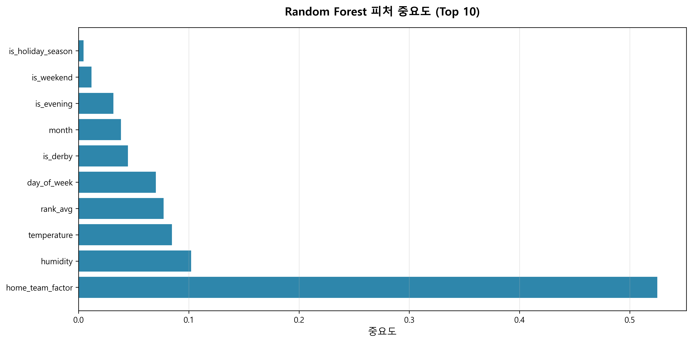

# GitHub 업로드 가이드

## 1. 프로젝트 최종 구조

```
k리그_관중_예측/
│
├── README.md                          # 프로젝트 개요 및 사용법
├── ANALYSIS.md                        # 상세 분석 리포트
├── GITHUB_GUIDE.md                    # 본 문서 (GitHub 업로드 가이드)
├── LICENSE                            # MIT 라이선스
├── requirements.txt                   # 필수 패키지 목록
├── .gitignore                         # Git 제외 파일
│
├── k_league_attendance_model.py       # 메인 모델 코드 (Prophet 기반)
│
├── data/                              # 원본 데이터 폴더
│   ├── k_league1_2022.csv             # 2022 시즌 데이터
│   ├── k_league1_2023.csv             # 2023 시즌 데이터
│   ├── k_league1_2024.csv             # 2024 시즌 데이터
│   └── k_league1_2025.csv             # 2025 시즌 데이터
│
└── results/                           # 모델 결과 및 시각화
    ├── 01_feature_importance.png      # 피처 중요도
    ├── 02_validation_performance.png  # 검증 성능
    ├── 03_season_2026_by_round.png    # 2026 라운드별 예측
    ├── 04_season_2026_monthly.png     # 2026 월별 예측
    ├── 05_seasonality_components.png  # 계절성 분석
    ├── 06_2025시즌_실제vs예측.png     # 2025 시즌 검증
    ├── 모델성능.csv                   # 성능 지표
    ├── 2025시즌_실제vs예측.csv        # 2025 시즌 예측 상세
    ├── 2026시즌_전체예측.csv          # 2026 시즌 예측 상세
    ├── 2026시즌_라운드별요약.csv      # 2026 라운드별 요약
    ├── 피처중요도.csv                 # 피처 중요도 수치
    └── 최적파라미터.csv               # 모델 하이퍼파라미터
```

---

## 2. GitHub 저장소 생성 및 업로드

### 2.1 GitHub 저장소 생성

1. GitHub (https://github.com) 로그인
2. 우측 상단 `+` 버튼 → `New repository` 클릭
3. 저장소 정보 입력:
   - **Repository name**: `kleague-attendance-prediction-prophet`
   - **Description**: Facebook Prophet를 활용한 K리그 관중 수 예측 (R² 0.624, MAE 2,979명)
   - **Public** 선택 (공개 프로젝트)
   - **Initialize this repository with a README** 체크 해제 (이미 README.md 있음)
4. `Create repository` 클릭

### 2.2 Git 초기화 및 업로드

터미널에서 프로젝트 폴더로 이동 후:

```bash
# 프로젝트 폴더로 이동
cd "H:/k리그 관중 예측"

# Git 초기화
git init

# 모든 파일 추가
git add .

# 첫 번째 커밋
git commit -m "Initial commit: Facebook Prophet를 활용한 K리그 관중 수 예측 (R² 0.624, MAE 2,979명)"

# GitHub 원격 저장소 연결 (본인의 GitHub 주소로 변경)
git remote add origin https://github.com/YOUR_USERNAME/kleague-attendance-prediction-prophet.git

# 메인 브랜치로 설정
git branch -M main

# GitHub에 푸시
git push -u origin main
```

### 2.3 GitHub에서 확인

1. GitHub 저장소 페이지 새로고침
2. README.md가 자동으로 표시되는지 확인
3. 폴더 구조 및 파일 확인

---

## 3. README.md 주요 수정 사항

GitHub에 올린 후 README.md에서 **절대 경로를 상대 경로로 수정**해야 합니다:

### 현재 (로컬 경로)
```python
data_path = "H:/k리그 관중 예측/data/"
results_path = "H:/k리그 관중 예측/results/"
```

### GitHub용 (상대 경로)
```python
data_path = "./data/"
results_path = "./results/"
```

또는 더 간단하게:

```python
data_path = "data/"
results_path = "results/"
```

이를 위해 `k_league_attendance_model.py` 파일을 수정:

```bash
# k_league_attendance_model.py 31-32번 줄 수정
git add k_league_attendance_model.py
git commit -m "Update file paths to relative paths for GitHub"
git push
```

---

## 4. 프로젝트 강조 포인트

### 4.1 README.md 상단 배지

README.md 최상단에 배지를 추가하여 프로젝트를 돋보이게 합니다:

```markdown


[](https://github.com/YOUR_USERNAME/kleague-attendance-prediction-prophet)
[](https://github.com/YOUR_USERNAME/kleague-attendance-prediction-prophet)
```

### 4.2 주요 시각화 이미지 삽입

README.md에 주요 그래프를 이미지로 삽입:

```markdown
## 주요 결과 시각화

### 피처 중요도


### 2026 시즌 예측


### 계절성 분석

```

---

## 5. 선택 사항

### 5.1 데이터 파일 제외 (용량 절감)

데이터 파일이 크다면 `.gitignore`에 추가하여 제외:

```bash
# .gitignore에 추가
data/*.csv
```

단, 이 경우 README.md에 다음 안내 추가:

```markdown
## 데이터 다운로드

본 프로젝트는 K리그 데이터포털의 데이터를 사용합니다.
데이터는 저작권 문제로 포함되지 않았으며, 다음 방법으로 직접 수집 가능합니다:

1. [K리그 데이터포털](https://data.kleague.com/) 접속
2. 2022-2025 시즌 경기 데이터 다운로드
3. `data/` 폴더에 저장
```

### 5.2 Jupyter Notebook 추가

분석 과정을 더 자세히 보여주고 싶다면:

```bash
# Jupyter Notebook 생성
jupyter notebook

# 새 노트북 생성: analysis.ipynb
# k_league_attendance_model.py의 코드를 섹션별로 정리
```

---

## 6. GitHub Pages 활성화 (선택)

프로젝트를 웹페이지로 공개:

1. GitHub 저장소 → `Settings` → `Pages`
2. Source: `main` 브랜치 선택
3. Folder: `/root` 선택
4. `Save` 클릭
5. 몇 분 후 `https://YOUR_USERNAME.github.io/kleague-attendance-prediction-prophet/` 접속 가능

---

## 7. 프로젝트 홍보

### 7.1 GitHub Topics 추가

저장소 페이지 우측 상단 `⚙️ About` → `Topics` 추가:
- `machine-learning`
- `prophet`
- `time-series`
- `k-league`
- `sports-analytics`
- `attendance-prediction`
- `python`
- `data-science`

### 7.2 README.md에 연락처 추가

```markdown
## Contact

- Email: your.email@example.com
- LinkedIn: [Your Name](https://linkedin.com/in/yourprofile)
- GitHub: [@YOUR_USERNAME](https://github.com/YOUR_USERNAME)
```

### 7.3 데모 비디오/GIF 추가 (선택)

모델 실행 과정을 GIF로 캡처하여 README에 추가하면 더욱 매력적입니다.

---

## 8. 커밋 메시지 예시

향후 업데이트 시 명확한 커밋 메시지 사용:

```bash
# 기능 추가
git commit -m "feat: Add LSTM ensemble model for improved accuracy"

# 버그 수정
git commit -m "fix: Correct date parsing error in 2025 data"

# 문서 수정
git commit -m "docs: Update README with installation guide"

# 성능 개선
git commit -m "perf: Optimize feature engineering process"

# 리팩토링
git commit -m "refactor: Simplify data preprocessing pipeline"
```

---

## 9. 최종 체크리스트

업로드 전 확인 사항:

- [ ] README.md에 프로젝트 설명 명확히 작성
- [ ] ANALYSIS.md에 상세 분석 포함
- [ ] requirements.txt에 모든 패키지 포함
- [ ] .gitignore에 불필요한 파일 제외
- [ ] LICENSE 파일 포함 (MIT)
- [ ] 절대 경로를 상대 경로로 수정
- [ ] 시각화 이미지가 results/ 폴더에 포함
- [ ] 코드에 주석 충분히 작성
- [ ] 민감 정보(API 키 등) 제거
- [ ] 모델 실행 가능 확인

---

## 10. 추천 GitHub 저장소 구조

```
kleague-attendance-prediction-prophet/
│
├── 📄 README.md              # 프로젝트 개요 (가장 중요!)
├── 📊 ANALYSIS.md            # 상세 분석
├── 📋 requirements.txt       # 패키지
├── 🔒 LICENSE               # 라이선스
├── 🙈 .gitignore            # Git 제외
│
├── 🐍 k_league_attendance_model.py  # 메인 코드
│
├── 📁 data/                 # 데이터
├── 📁 results/              # 결과
└── 📓 notebooks/            # (선택) Jupyter Notebooks
```

---

**GitHub 업로드 완료 후 URL을 포트폴리오, 이력서에 추가하세요!**

예: `https://github.com/YOUR_USERNAME/kleague-attendance-prediction-prophet`
